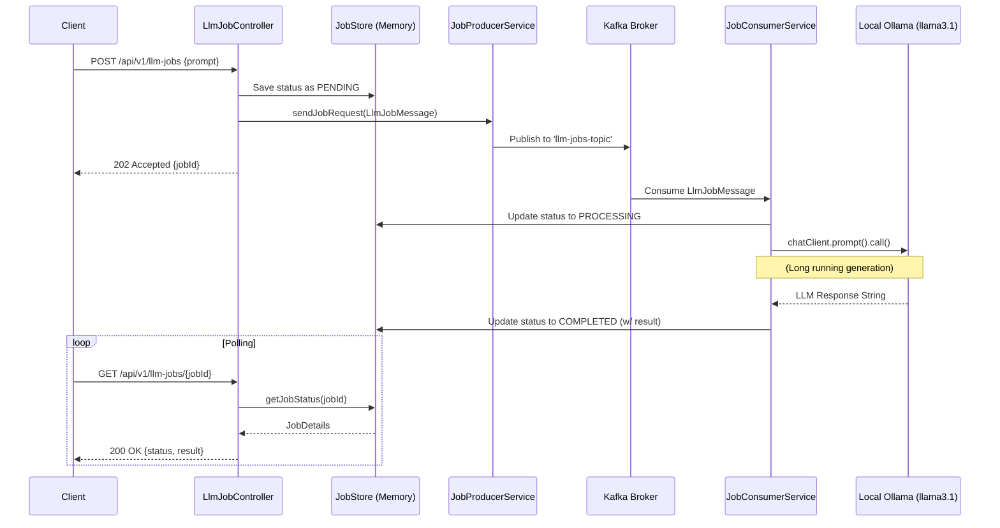

# Asynchronous LLM API with Spring Boot, Kafka, and Ollama

This project implements an event-driven, asynchronous REST API for executing long-running Large Language Model (LLM) tasks. It leverages **Spring Boot**, **Spring AI**, **Apache Kafka**, and **Ollama** to process prompts without blocking HTTP threads.

## Architecture Overview

When a client submits a prompt, the API immediately returns a unique `Job ID`. The task is placed onto a Kafka topic where a background consumer picks it up, communicates with the local Ollama instance, and updates an in-memory store upon completion. Clients can use the `Job ID` to poll the status and retrieve the final response.

### Sequence Diagram



## Prerequisites

1.  **Java 17+** and **Maven** installed.
2.  **Apache Kafka**: A running cluster (configured for `kafka1:9092,kafka2:9092,kafka3:9092` in `application.yml`).
3.  **Ollama**: Running and accessible at `http://192.168.124.7:11434` with the `llama3.1:latest` model pulled.

## Building and Running

1.  **Build the application:**
    ```bash
    mvn clean package -DskipTests
    ```

2.  **Run the packaged JAR:**
    ```bash
    java -jar target/oksai-0.0.1-SNAPSHOT.jar
    ```
    *(Note: Replace the JAR name with the exact output from your `target/` directory).* The application will start and listen on port `9090`.

## API Usage

### 1. Submit a Job
Submit your prompt to the API. It will queue the job in Kafka and return immediately.

**Request:**
```bash
curl -X POST http://localhost:9090/api/v1/llm-jobs \
-H "Content-Type: application/json" \
-d '{"prompt": "Write a detailed architectural overview of consistent hashing in distributed systems."}'
```

**Response:**
```json
{
  "jobId": "39cf712d-5a94-4ef8-ab6a-f5a3d0ad4c64",
  "message": "Job submitted successfully"
}
```

### 2. Poll Job Status
Use the `jobId` returned from the previous step to check the status. 

**Request:**
```bash
curl http://localhost:9090/api/v1/llm-jobs/39cf712d-5a94-4ef8-ab6a-f5a3d0ad4c64
```

**Response (While Processing):**
```json
{
  "status": "PROCESSING",
  "prompt": "Write a detailed architectural overview of consistent hashing in distributed systems.",
  "result": null
}
```

**Response (When Completed):**
```json
{
  "status": "COMPLETED",
  "prompt": "Write a detailed architectural overview of consistent hashing in distributed systems.",
  "result": "**Consistent Hashing: A Distributed System's Secret Weapon**\n\nIn the realm of distributed systems..."
}
```

## Technologies Used
* **Spring Boot Web**: Exposes REST endpoints.
* **Spring Kafka**: Produces and consumes messages asynchronously. Configured with JSON serialization.
* **Spring AI (Ollama Starter)**: Interfaces with the local LLM instance.
* **ConcurrentHashMap**: Provides an thread-safe, in-memory datastore for job states.
